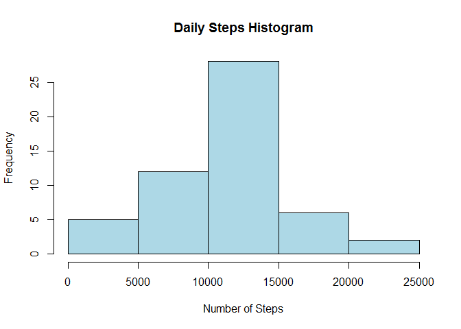

# Reproducible Research: Peer Assessment 1


## Loading and preprocessing the data

First we unzip the file, and then load it to the activity variable:

```r
unzip("activity.zip")
activity <- read.csv("activity.csv",header=TRUE)
```

## What is mean total number of steps taken per day?

To calculate the total daily steps for each day, the aggregate function inserts the summarized data into the ActSum variable.

```r
ActSum <- aggregate(activity$steps,by=list(activity$date),FUN=sum)
hist(ActSum$x,col="lightblue",xlab = "Number of Steps",main="Daily Steps Histogram")
```

<!-- -->


```r
dailyMean <- format(mean(ActSum$x,na.rm=TRUE),digits=2,nsmall = 2,big.mark = ",", big.interval=3)
dailyMedian <- format(median(ActSum$x,na.rm=TRUE),digits=2,nsmall = 2,big.mark = ",", big.interval = 3)
```

The daily mean is 10,766.19, the daily median is 10,765

## What is the average daily activity pattern?


## Imputing missing values


## Are there differences in activity patterns between weekdays and weekends?
