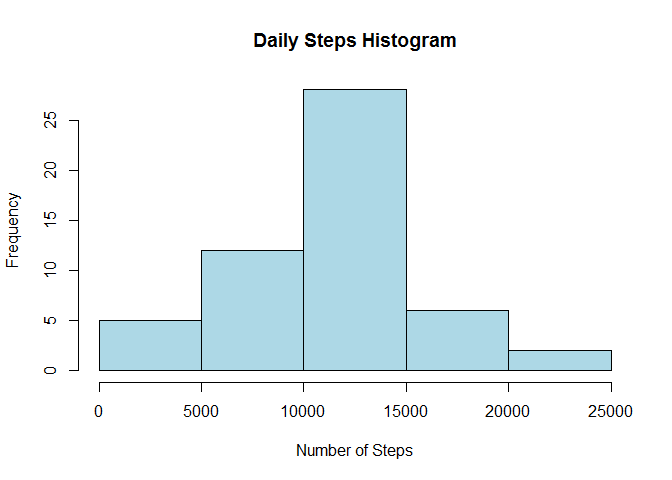
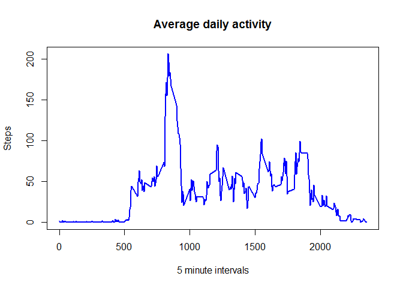
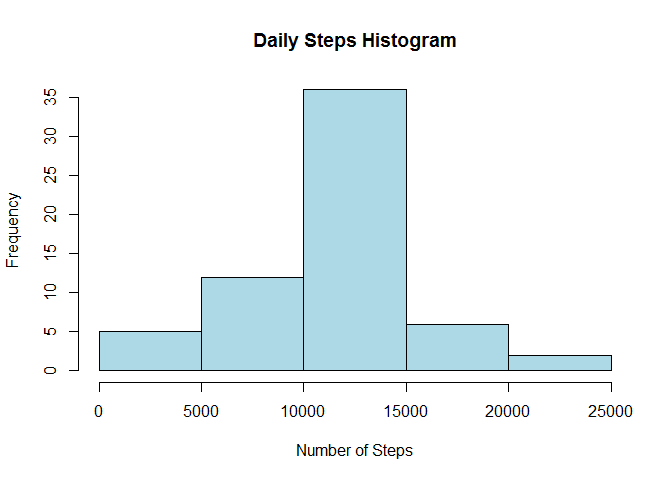
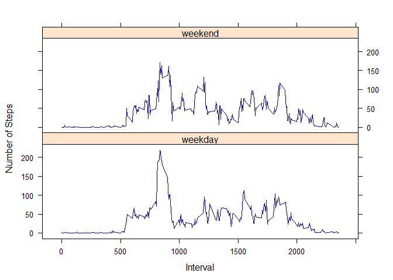

# Reproducible Research: Peer Assessment 1


## Loading and preprocessing the data

First unzip the file, and then load it to the activity variable:

```r
unzip("activity.zip")
activity <- read.csv("activity.csv",header=TRUE)
```

## What is mean total number of steps taken per day?

To calculate the total daily steps for each day, the aggregate function inserts the summarized data into the ActSum variable, and then plot the daily steps histogram:

```r
# Get the total steps by day.
ActSum <- aggregate(activity$steps,by=list(activity$date),FUN=sum)
# Plot the histogram
hist(ActSum$x,col="lightblue",xlab = "Number of Steps",main="Daily Steps Histogram")
```

<!-- -->


```r
# Calculating daily mean, removing the NA and formatting the text output.
dailyMean <- format(mean(ActSum$x,na.rm=TRUE),digits=2,nsmall = 2,big.mark = ",", big.interval=3)
# Calculating daily median, removing the NA and formatting the text output.
dailyMedian <- format(median(ActSum$x,na.rm=TRUE),digits=2,nsmall = 2,big.mark = ",", big.interval = 3)
```

The daily mean is 10,766.19, the daily median is 10,765

## What is the average daily activity pattern?
To calculate the mean of each 5 minute inteval, first remove the NA and then summarize using the mean formula. Then plot the results.

```r
#Selecting only complete cases (rows without NA)
ActivityNoNA <- activity[complete.cases(activity),]

#Summarizing the data by interval, calculating the mean
IntervalMean <- aggregate(ActivityNoNA$steps,by=list(ActivityNoNA$interval),FUN=mean)

#Plot
plot(IntervalMean$Group.1,IntervalMean$x,xlab="5 minute intervals",ylab="Steps",main="Average daily activity",type="l",col="blue",lwd=2)
```

<!-- -->

```r
#Sort the data by mean of steps, descending
IMSorted <- IntervalMean[order(-IntervalMean$x),]

MaxStepsInterval <- IMSorted[1,1]
```
The 5 minute interval that, on average, contains the maximum number of steps is: 835 

## Imputing missing values

Replace the NA values with the mean for each interval that was determined in the previous step.


```r
#Count missing values.
CountNA <- sum(is.na(activity$steps))

#Making a copy of the original Data Frame
ActivityReplacedNA <- activity

#Replacing the NA values with the mean of the specific interval.
for(i in 1:nrow(ActivityReplacedNA)) {
      if(is.na(ActivityReplacedNA[i,1])) {
            ActivityReplacedNA[i,1] <- IntervalMean[IntervalMean$Group.1==ActivityReplacedNA[i,3],2]
      }
}

#Sumarizing the new Data Frame with the replaced values.
ActSum <- aggregate(ActivityReplacedNA$steps,by=list(ActivityReplacedNA$date),FUN=sum)

#Plot the histogram
hist(ActSum$x,col="lightblue",xlab = "Number of Steps",main="Daily Steps Histogram")
```

<!-- -->

The total number of missing values on the dataset is 2304


```r
# Calculating daily mean and formatting the text output.
dailyMean <- format(mean(ActSum$x),digits=2,nsmall = 2,big.mark = ",", big.interval=3)

# Calculating daily median and formatting the text output.
dailyMedian <- format(median(ActSum$x),digits=2,nsmall = 2,big.mark = ",", big.interval = 3)
```


Using the Data Frame with replaced NA values, the daily mean is 10,766.19, the daily median is 10,766.19.

The histogram varies significantly after the missing values are replaced with the interval average, but the mean and median are almost the same.
## Are there differences in activity patterns between weekdays and weekends?

First add a vector with the information if the date is a weekday or a weekend. Didn't use the weekdays() function as suggested to avoid localization issues, and rather used the POSIXlt$wday, that returns the day of week as a number.

Finally used the lattice library instead of the default library to get the same result as the example.


```r
#Adding the factor column and filling it with "weekend" or "weekday" depending on the date.
ActivityReplacedNA$Day <- ifelse(as.POSIXlt(ActivityReplacedNA$date)$wday <= 1,"weekend", "weekday")

#Getting the mean of each 5 minute interval, and including the weekend/weekday factor.
IntervalMean <- aggregate(ActivityReplacedNA$steps,by=list(ActivityReplacedNA$interval,ActivityReplacedNA$Day),FUN=mean)

#Plot the panel using the lattice library.
library(lattice)
xyplot(x ~ Group.1 | Group.2, data= IntervalMean, col="blue",type = "l", layout = c(1,2), xlab = "Interval", ylab="Number of Steps" )
```

<!-- -->

